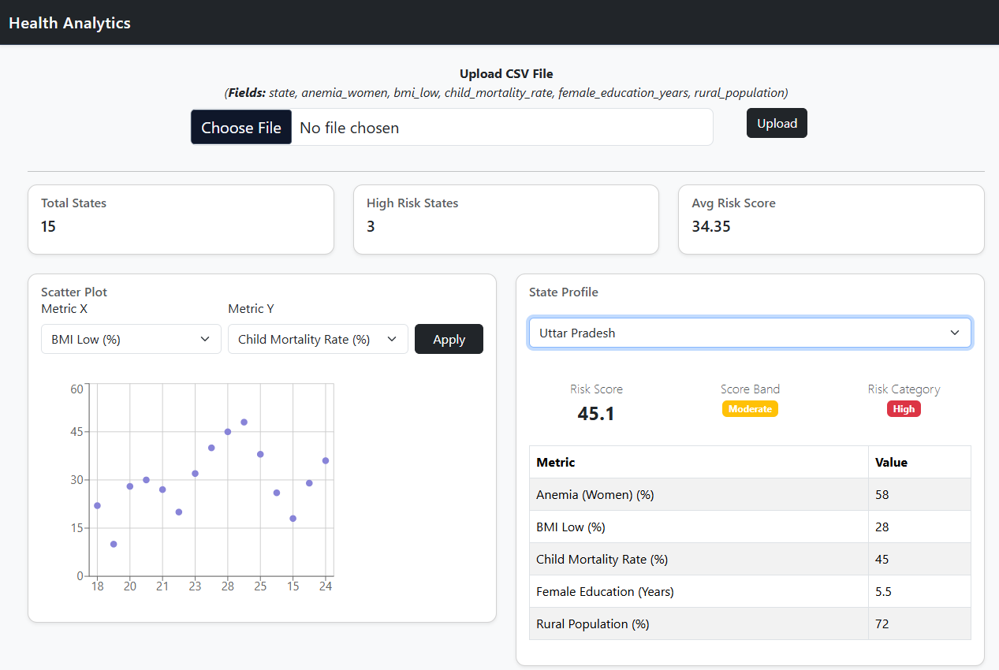
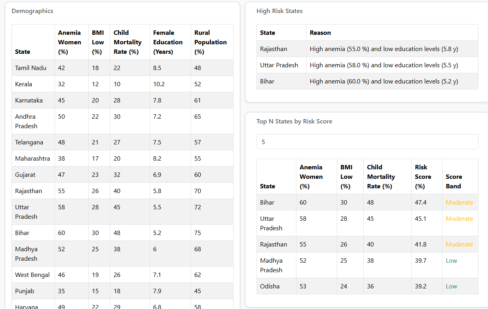

# 📊 Health Analytics Dashboard

> Built as a full-stack project (React + FastAPI backend)

A React-based dashboard to upload and analyze state-level health data, with interactive visualizations and actionable insights.

Backend API Docs Page - 
---

## 🚀 Features

* 📁 Upload CSV data (health & demographic indicators)
* 📊 Dashboard summary (total states, high-risk states, avg risk score)
* 📈 Interactive scatter plot (dynamic X/Y metric selection)
* 🧭 State profile with key metrics and breakdown
* ⚠️ High-risk states with contextual reasons
* 🔝 Top N states by risk score

---

## 🛠️ Tech Stack

* **Frontend:** React (TypeScript), Vite
* **UI:** React Bootstrap
* **Charts:** Recharts
* **Backend:** FastAPI

---

## 📸 UI Preview

### Dashboard Overview



### Data Tables & Insights



---

## ⚙️ Setup

```bash
npm install
npm run dev
```

Create `.env`:

```env
VITE_BASE_URL=http://localhost:8000
```

---

## 🧠 Key Design Choices

* Kept state management simple using React hooks (no global state library)
* Built a reusable table component for multiple data views
* Used component-level data fetching for modularity
* Explicit “Apply” action for scatter plot to control re-renders

---

## 📌 Notes

* Dataset is uploaded via CSV
* Not all states may be present depending on input file
